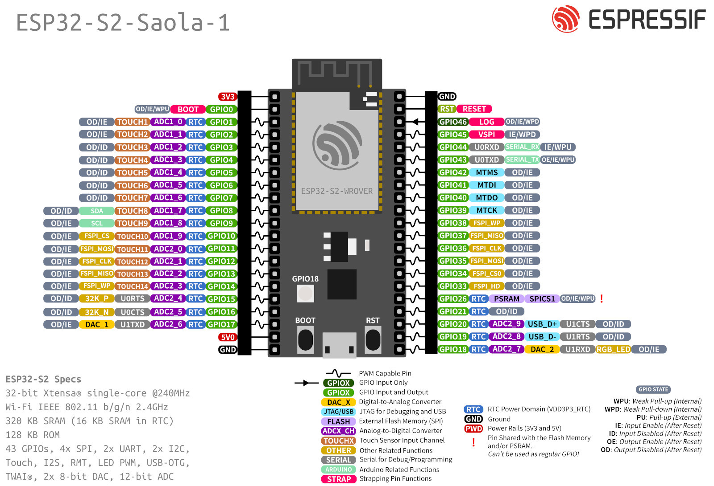

# seedsigner-micropython

## Components
* [ESP32-S2 Saola-1R](https://docs.espressif.com/projects/esp-idf/en/latest/esp32s2/hw-reference/esp32s2/user-guide-saola-1-v1.2.html) dev board
* [Waveshare 1.3inch LCD hat](https://www.waveshare.com/wiki/1.3inch_LCD_HAT)
* [Waveshare OV2640 camera board](https://www.waveshare.com/wiki/OV2640_Camera_Board)
* [2x20-pin "cobbler"](https://www.adafruit.com/product/2028?gclid=Cj0KCQjwkOqZBhDNARIsAACsbfLKAPKg5A5dfSaf1j_2NS4z5OK6aWafQ-Pz_27lGPgF8Ta9fMtniCgaAkBsEALw_wcB) to breadboard the LCD hat's Raspberry Pi gpio connector


## ESP32-S2 Saola-1R wiring


Note that the Waveshare display hat should have the joystick on the left side. The corners of the GPIO connector are:
```
GND 26 19                                   SCL SDA 3V3
(joystick on left)      (screen)        (three buttons)
 21 20 16                                   GND  5V  5V
```

_(the Adafruit cobbler should be oriented upside down, relative to the LCD hat)_


ST7789 display (via Waveshare hat):
```
ST7789      RASPI GPIO      SAOLA
---------------------------------
3.3V        3V3
GND         GND
SCLK        11/SCLK         12 (FSPI_CLK)
MOSI        10/MOSI         11 (FSPI_MOSI)
CS          8/CE0           10 (FSPI_CS)
DC          25               1
RST         27               2
BL          24              (not connected)
```

Waveshare hat joystick/button inputs:
```
BUTTON          RASPI GPIO      SAOLA
-------------------------------------
joystick up      6              13
joystick down   19              14
joystick left    5              15
joystick right  26              16
joystick press  13              17
key 1           21               3
key 2           20              34
key 3           16              33
```

OV2640 camera

_note: the camera module lists D2 through D9 but the camera driver expects d0 through d7. Map D2 as d0, D3 as d1, ..., D9 as d7._

```
OV2640      SAOLA
-----------------
3.3V
GND
SIOC         9 (SCL)
SIOD         8 (SDA)
VSYNC        7
HREF         6
PCLK         5
XCLK         4
D9          42
D8          41
D7          40
D6          39
D5          38
D4          37
D3          36
D2          35
RET         (not connected)
PWDN        (not connected)
```
